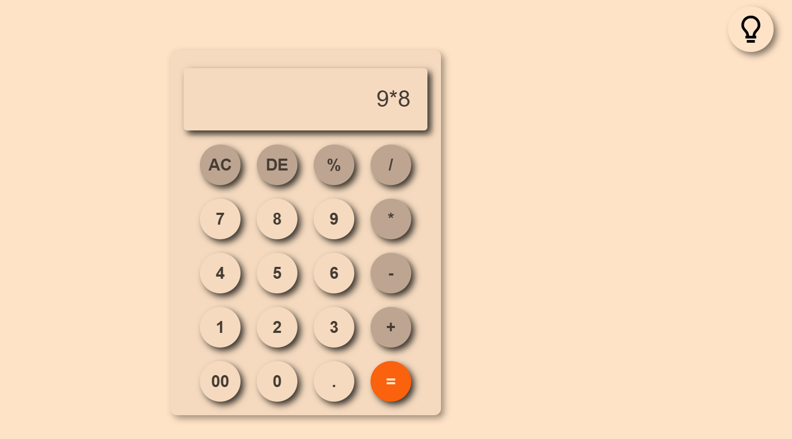
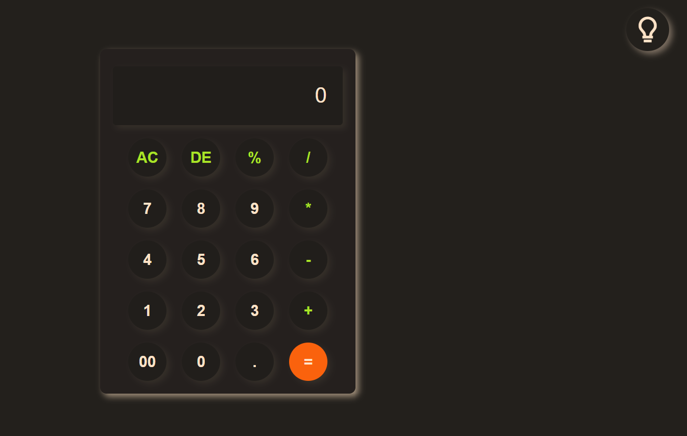

# Description
This is a Responsive Calculator Web App built using HTML, CSS, and JavaScript.
It can perform basic arithmetic operations and display the results instantly.

# Features
<b>1) <u>Responsive Design</u></b> – Works seamlessly on all screen sizes (desktop, tablet, and mobile).

<b>2) <u>Basic Arithmetic Operations</u></b> – Supports addition, subtraction, multiplication, division, and percentage.

<b>3) <u>Dark & Light Mode</u></b> – Easily switch themes with a single click.

<b>4) <u>Delete & Clear Functions</u></b> – Remove a single digit or reset the entire calculation.

<b>5) <u>Double Zero (00) Support</u></b> – Convenient shortcut for faster input.

<b>6) <u>Clean & Modern UI</u></b> – Rounded buttons, shadows, and smooth styling.

# My Learning
In this project I learned about
<b>1) <u>DOM Manipulation and Event Listeners</u></b>: Handling user interactions by displaying numbers and operators on the screen when a button is clicked.

<b>2) <u>Dark To Light Mode Toggle</u></b>: Implementing a theme switcher using CSS styling changes triggered by JavaScript events.

<b>3) <u>eval(String) function</u></b>: Parsing and executing string-based mathematical expressions to calculate the final results for the "=" button.

# Overview Images

# Light Mode

# Dark Mode
