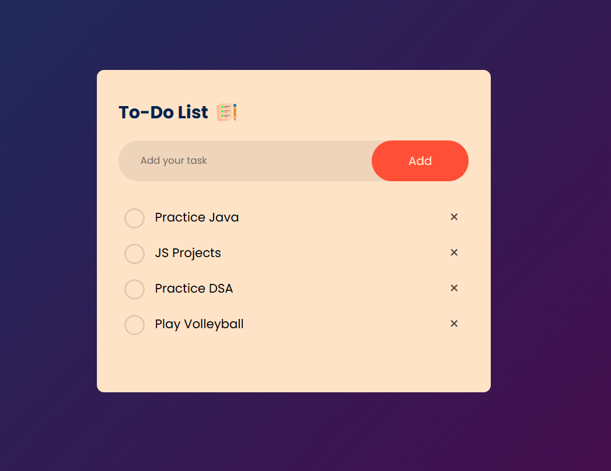

# Description
This is a Responsive To-Do List Web App built using HTML, CSS, and JavaScript.
It allows users to create, manage, and organize daily tasks efficiently.

# Features
<b>1) <u>Responsive Design</u></b> – Works seamlessly on all screen sizes (desktop, tablet, and mobile).

<b>2) <u>Add New Tasks</u></b> – Easily create tasks by typing in the input box and pressing Enter or clicking the add button.

<b>3) <u>Mark as Completed</u></b> – Click on a task to mark it as done, with a strikethrough effect for visual clarity.

<b>4) <u>Delete Tasks</u></b> – Remove unwanted tasks instantly with a single click.

<b>5) <u>Persistent Data</u></b> – Stores tasks in the browser’s local storage so they remain even after refreshing the page.

<b>6) <u>Clean & Minimal UI</u></b> – Simple, modern design with smooth animations for a better user experience.

# My Learning
In this project I learned about:

<b>1) <u>DOM Manipulation and Event Listeners</u></b>: Adding, marking, and deleting tasks dynamically using JavaScript.

<b>2) <u>Local Storage</u></b>: Saving and retrieving tasks to ensure data persistence between sessions.

<b>3) <u>CSS Styling & Animations</u></b>: Creating a clean, responsive, and interactive interface with hover effects and transitions.

# Overview Images
