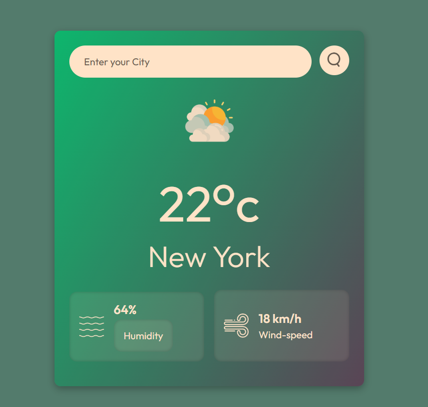

# Description
This is a Responsive Weather Web App built using HTML, CSS, and JavaScript.
It can search temperature, humidity and wind-speed by just typing the City name and display the results instantly.

# Features
<b>1) <u>Responsive Design</u></b> – Works seamlessly on all screen sizes (desktop, tablet, and mobile).

<b>2) <u>Real-time Weather Data</u></b> – Fetches up-to-date temperature, humidity, and wind speed for any city worldwide using the OpenWeatherMap API.

<b>3) <u>Intuitive Search Interface</u></b> – User-friendly search bar with instant results upon clicking the search icon.

<b>4) <u>Dynamic Weather Icons</u></b> – Displays relevant weather condition images (e.g., clouds, rain, drizzle) based on real-time data.

<b>5) <u>Clean and Modern UI</u></b> – Designed with gradients and smooth layouts to provide a visually appealing experience.

# My Learning
In this project I learned about
<b>1) <u>DOM Manipulation and Event Listeners</u></b>: Handling user interactions by displaying temperature, humidity and wind-speed on the screen when a button is clicked.

<b>2) <u>Fetching required data from API</u></b>: By using async/await I fetched the required data and displayed in the screen

# Overview Images

